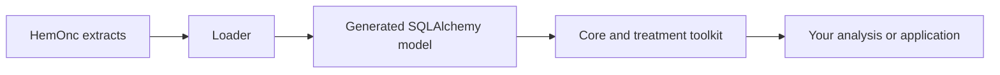

# HemOnc Alchemy

HemOnc Alchemy is the Python boundary around an imported HemOnc.org terminology database. It gives research and application code typed SQLAlchemy models, reusable queries, and a small set of treatment interpretations without making either side parse source spreadsheets or maintain a second copy of the terminology.

## The mental model

The package has three layers:

The generated model describes what was loaded. The core toolkit helps you navigate that model. The treatment toolkit adds explicit clinical or operational policy, such as what counts as a category or how to identify a standalone radiation sig. Your application still owns cohort definitions, local protocol policy, OMOP mappings, and presentation.

That separation is the most important design decision in the project. If a question is about the source tables, use the model or `toolkit.core`. If it requires an interpretation of treatment, use `toolkit.analytics.treatment`. If it is specific to a consumer, keep it outside the package.

## Start with the row grain

Most analysis errors come from counting the wrong thing. The common grains are:

| Entity | One row represents |
|---|---|
| `Conditions` | A HemOnc condition and condition CUI |
| `Regimens` | A named regimen |
| `Variants` | A concrete, versioned regimen variant |
| `Sigs` | One dosing instruction within a variant |
| `Drugs` | A treatment component or drug identity |
| `Indications` | A drug/condition regulatory indication and its metadata |
| `Studies` | A source-study row associated with HemOnc content |
| `StudyResults` | A recorded study outcome |

A variant has many sigs. A study name can occur in several `Studies` rows. A CUI can have multiple imported versions. Decide the unit of analysis before writing a count or join.

## Keep identifiers separate

HemOnc CUIs are source identifiers. Database rows may also have generated surrogate primary keys. OMOP `concept_id` is a different identifier again. A CUI may be used as `concept_code` in the registered HemOnc OMOP vocabulary, but it is not itself an OMOP `concept_id`.

`Variants` has the natural key `(variant_cui, version)`. A latest-version query is a policy choice, not a property of the CUI. `Sigs` currently link to variants through `variant_cui` without a version, so a sig relationship cannot prove version-specific provenance.

## Choose a path

- [Get started](getting-started/index.md) when you need an environment and a session.
- [Understand the model](model/index.md) before writing joins or aggregations.
- [Use the toolkit](toolkit/index.md) for condition lookup, component search, treatment selection, and schedule projections.
- [Read the API reference](reference/index.md) when you already know which boundary you need.
- [Regenerate the model](maintainers/regeneration.md) only when maintaining the schema or generated code.

The local development stack is optional. HemOnc Alchemy expects a reachable PostgreSQL database containing the generated schema; it does not provision production data.

## Project status

The generated model follows the current HemOnc data dictionary. The toolkit area packages are the stable conceptual boundary for application code; lower-level generated surfaces and compiler modules are implementation or maintenance interfaces.
