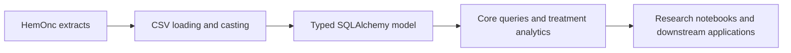

# HemOnc Alchemy

HemOnc Alchemy turns the [HemOnc.org](https://hemonc.org) oncology terminology
into typed SQLAlchemy models and composable query tools.

It is for people who want to ask questions of imported HemOnc data in Python:
which conditions are associated with a regimen, which drugs make up a variant,
which studies support it, and when its components are administered. The package
keeps those questions close to the database without making an application own a
second copy of the terminology or parse source spreadsheets directly.

## Where HemOnc Alchemy fits

HemOnc Alchemy sits between an imported HemOnc database and research,
analytics, and integration code:

The model is the structural boundary. The toolkit adds reusable interpretation
and retrieval rules. A downstream application remains responsible for its own
protocol configuration, synthetic data, OMOP mappings, and presentation policy.

## Start here

If you are new to the package:

- [Install and configure](getting-started/installation.md) a working Python environment.
- Follow the [quickstart](getting-started/quickstart.md) to connect and query a variant.
- Read [entities and generated models](model/entities.md) to understand the row grain.
- Use the [toolkit overview](toolkit/index.md) to choose a query boundary.

If you are running the local development stack, see [local development](getting-started/local-development.md).

## A note about versioning and links

HemOnc has several important data-shape details that affect analysis:

- `Variants` has a generated surrogate ID and a natural key of
  `(variant_cui, version)`.
- Multi-valued source fields are loaded into child tables such as
  `variants_study` and `sigs_study`.
- `Sigs` currently links to variants by `variant_cui`, not by version.

The guides call these out where they affect a result. Do not treat a convenient
ORM attribute as proof that a source row has version-specific provenance.

## Project status

The package is an actively developed working-branch project. The generated
model follows the current schema registry, while toolkit area packages provide
the clearest boundary for application code. Review the regeneration and toolkit
guides before depending on lower-level implementation modules.
