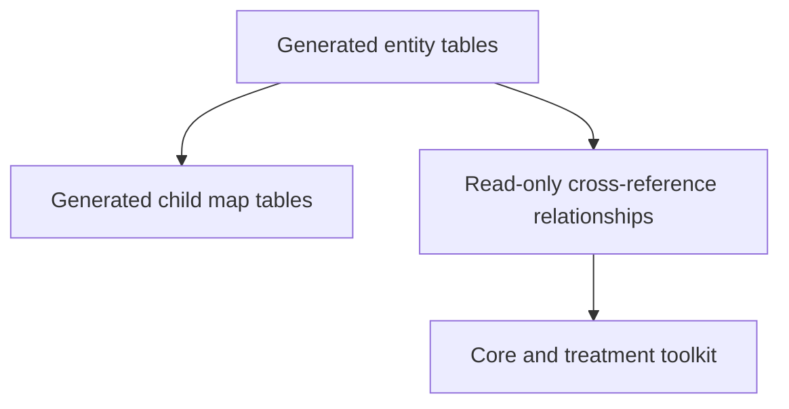

# Understanding the HemOnc model

HemOnc Alchemy exposes the imported terminology as generated SQLAlchemy entity
classes. The generated model describes table shape and source data; the toolkit
adds model-facing queries and clinical interpretation around it.

## Main row grains

| Entity | One row represents |
|---|---|
| `Conditions` | a HemOnc condition and its condition CUI |
| `Regimens` | a named treatment regimen |
| `Variants` | one versioned concrete regimen variant |
| `Sigs` | one dosing instruction within a variant |
| `Drugs` | a treatment component or drug identity |
| `Studies` | a study/source row associated with HemOnc content |
| `StudyResults` | a reported study outcome |
| `Indications` | a condition/regimen indication and its evidence metadata |

The row grain matters when counting. A variant can have many sigs, a sig can
have many study links, and a source study name may occur in more than one
`Studies` row.

## Read the model in layers

- [Entities and generated models](entities.md) explains what is generated and
  how to choose a class.
- [Relationships and cross-references](relationships.md) explains normalized
  child tables, surrogate IDs, and ambiguous links.
- [Loading data](loading.md) explains how source extracts become rows.
