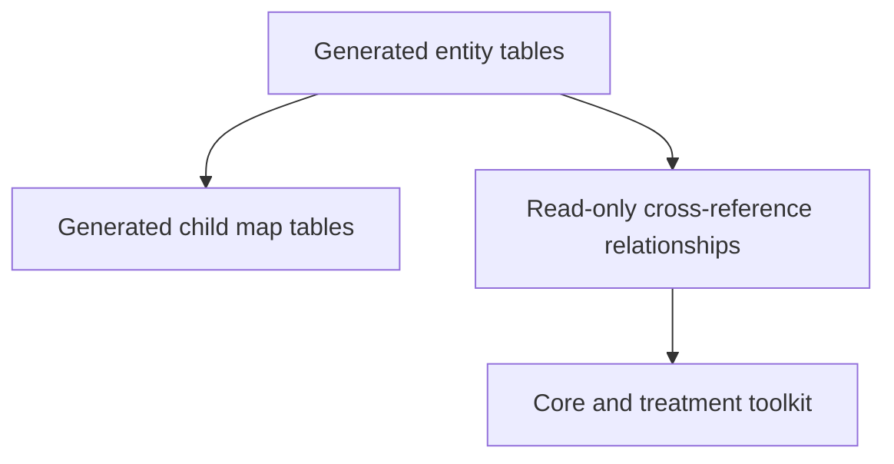

# Understanding the HemOnc model

The generated SQLAlchemy model is a typed view of the imported source. It tells you what rows and fields exist; it does not decide what a row means for a particular application. That distinction is why the toolkit sits above the model.

## The core row grains

| Entity | One row represents |
|---|---|
| `Conditions` | A HemOnc condition and its CUI |
| `Regimens` | A named regimen |
| `Variants` | A concrete regimen variant and imported version |
| `Sigs` | One dosing instruction within a variant |
| `Drugs` | A treatment component or drug identity |
| `Studies` | A study/source row associated with HemOnc content |
| `StudyResults` | A recorded outcome from a study |
| `Indications` | A regulatory indication and its evidence metadata |

These grains are deliberately different. Counting sigs answers a question about dosing instructions, not regimens. Counting indications answers a question about regulatory records, not distinct drugs. A join can multiply rows even when every table is correct.

## Read the model in layers

- Generated entities describe table shape.
- Generated child maps preserve multi-valued source fields in normalized form.
- Hand-written relationships provide convenient traversal but do not change source identity.
- Toolkit functions add reusable query or treatment policy.

Start with the generated class when you need a structural query. Move to the toolkit when the operation involves recurring cross-reference logic, version policy, treatment classification, or schedule interpretation.

## The identity model

There are three identities to keep distinct:

1. A generated database row has a surrogate `id`.
2. A HemOnc concept has a source CUI such as `condition_cui` or `drug_cui`.
3. An OMOP concept has an OMOP `concept_id`.

The same value should not be used interchangeably across those roles. See [Entities and generated models](entities.md) and [Relationships and cross-references](relationships.md) before writing joins.
