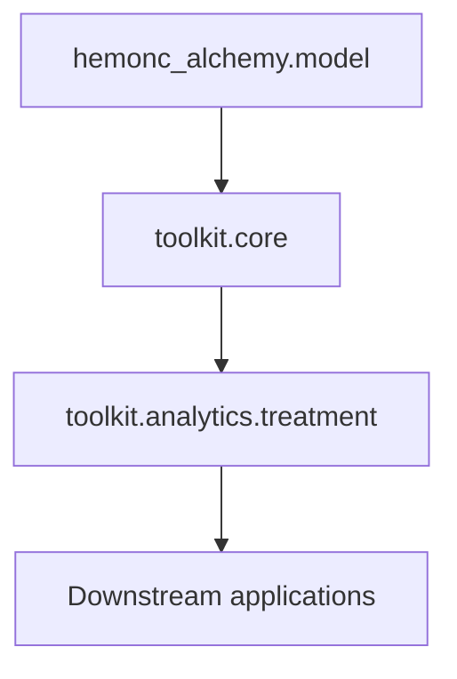

# Toolkit

The toolkit answers model-level questions without hiding the underlying
SQLAlchemy boundary. Query statements remain inspectable, execution requires a
caller-supplied session, and model relationships remain read-only.

## Choose an area

| If you need to… | Start with |
|---|---|
| Resolve condition names, search components, or follow normalized links | [`core`](core.md) |
| Classify treatment modality, filter standalone RT, or select variants | [`treatment`](treatment.md) |
| Resolve dosing notation or compare administration across cycle days | [`scheduling`](scheduling.md) |
| Load source CSVs into a database | [`toolkit.loading`](../model/loading.md) |

## Dependency direction



Core operations describe HemOnc model behavior. Treatment analytics add domain
policy. Downstream applications adapt their own protocol or reporting objects
to these boundaries rather than importing application policy into the model.

## Public imports

Import from an area package:

```python
from hemonc_alchemy.toolkit.core.components import search_components
from hemonc_alchemy.toolkit.analytics.treatment.selection import select_variants
```

The lower-level module paths are useful when reading the API reference, but the
area-level names are the intended application boundary.
