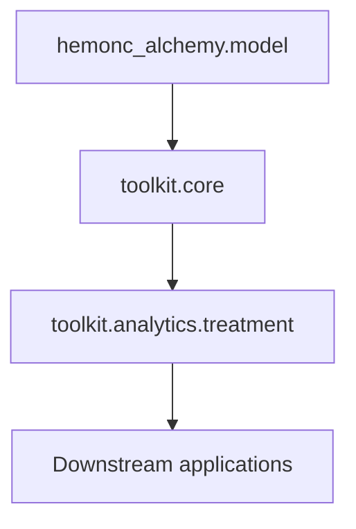

# Toolkit

The toolkit is the application-facing layer above the generated model. Its useful distinction is not “which helper exists,” but “who owns the meaning of this query?”

## Choose the boundary

| Question | Boundary |
|---|---|
| What conditions, drugs, studies, or sigs are linked in HemOnc? | `toolkit.core` |
| Which variants satisfy component or category requirements? | Treatment selection |
| Is a variant radiation-only, concurrent chemoradiotherapy, or otherwise classified? | Treatment classification |
| Which days and routes does a sig imply? | Scheduling |
| What does this consumer call a modality, bundle, or eligible cohort? | Your application |

Core operations describe the source model. Treatment analytics encode reusable oncology meaning. Consumer-specific policy should be translated into toolkit specifications or kept in the consuming application rather than added to the generated model.

## Statements versus execution

Many toolkit operations have two forms:

- a statement builder that returns inspectable SQLAlchemy `Select` objects;
- an execution helper that accepts your `Session` and returns ORM rows or read models.

This is intentional. The toolkit does not hide joins, choose your transaction boundary, or force a pandas representation. Build a statement when you need to add predicates, inspect SQL, or compose it into a larger query.

## Dependency direction



Import from an area package at the application boundary:

```python
from hemonc_alchemy.toolkit.core.components import search_components
from hemonc_alchemy.toolkit.analytics.treatment.selection import select_variants
```

The generated model and lower-level compiler modules remain available for structural work and maintenance, but they are not substitutes for the toolkit's explicit policies.
